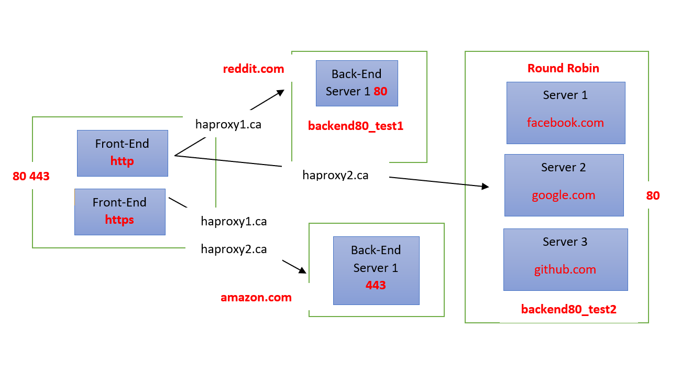

## HAPROXY Load-balancing CentOS 7

* yum -y update
* yum -y install haproxy
* systemctl start haproxy
* systemctl enable haproxy

## Configuration
### Modify these files
* /ect/hosts for Linux, MacOS
* C:\Windows\System32\Drivers\etc\hosts for Window OS

#### Append 2 lines below:
* 127.0.0.1	haproxy2.com
* 127.0.0.1	haproxy1.com

Check these files below:
* Dockerfile
* docker-compose.yml
* haproxy.cfg

-> docker-compose up